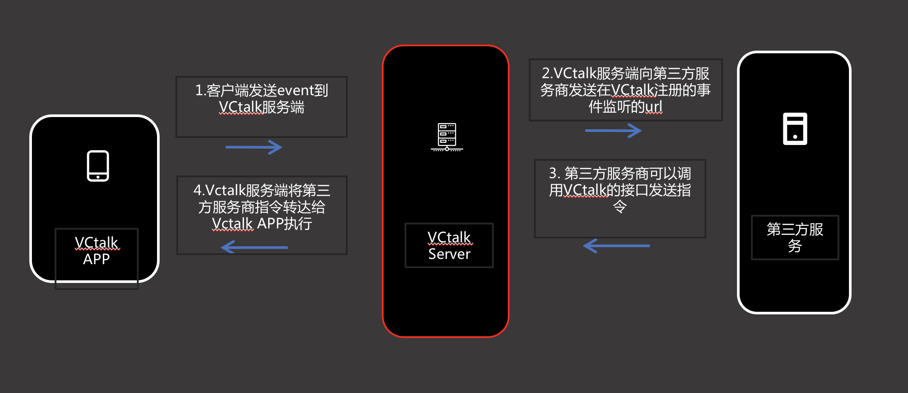

title: VVChat开放平台文档
---

# 机器人流程说明

准备：

1. 申请appid和appkey

2. 提供机器人的事件监听url

架构图

流程如下：

1. VVChat APP触发某一个事件。

2. VVChat Server 监听到需要触发的事件后，会调用第三方服务在VVChat Server里注册的事件url，将通过此url将事件下发给第三方服务端。

3. 第三方服务端收到事件后可以调用 VVChat Server提供的接口向自己的机器人下发指令，例如发送消息，控制群聊webview的打开，关闭，高度等等

举例说明：

用户将某个机器人添加到群里的时候，VVChat Server监听到此事件，将调用第三方服务的url将此事件和对应的数据告知第三方服务，第三方服务可以调用发送消息下发打开群里的webview的指令。